# Simple-Animation-Runner
A super simple animation runner for previewing animations in unity. 

This repo contains a unity project with 3 scenes. Each scene has a functioning example of an animation runner which you 
can replace with your own assets to preview your animations. These runners are super-simple, they are built to allow you
to demonstrate your animation clips or images in unity without needing to build a bunch of game systems to support them.

The three scenes each provider a different kind of animation runner (2D single images, 2D sprite-sheets and 3D rigged 
models). They allow you to create a list of the different animations and assign a keyboard key to each. When you press
play in the editor, the first clip will start. Pressing your assigned keys will play their respective clips.

This document contains instructions for how to import your assets into this unity so that you can replace the examples
with your own creations.

## Downloading this project

---
## Single Frame Sprites

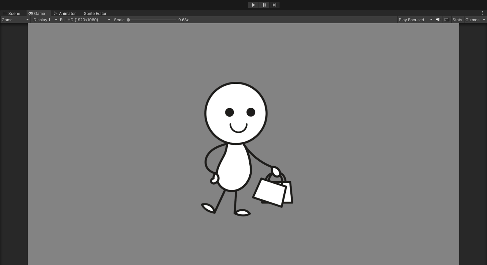

This scene is built for those of you who have a few key poses but no animations. 

To import your own images, first save 
them as .png files and drag them into a folder in the unity project (e.g. ***Assets/Animation Assets/MyCharacter***).

The example assets for this scene can be found in ***Assets/Animation Assets/Stickman***. To use this example, your character 
folder should look like this (i.e. a folder containing .png files)

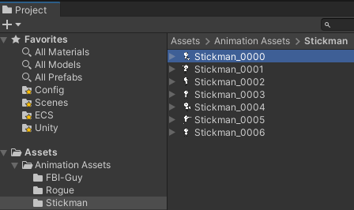

### Using The Scene:

1. Open the ***SingleFrameSprites*** scene (***Assets/Scenes/SingleFrameSprites***)

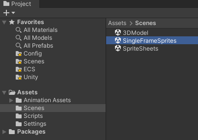

2. In the hierarchy, select the GameObject named **SingleFrameSpriteController**

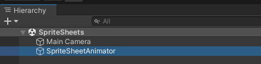

3. In the inspector, locate the **SimpleSpriteController** script and expand the **AnimationData** drop-down.

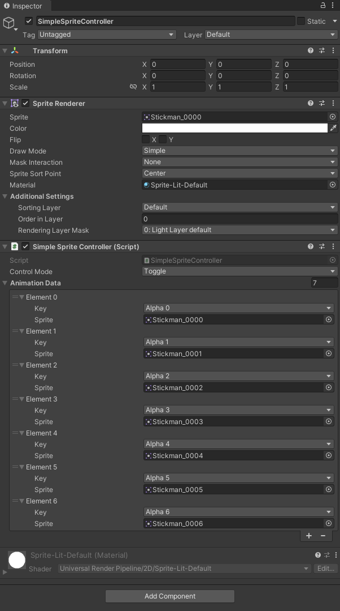

4. Replace the existing images with your own sprites.

5. If you want to, change the keys assigned to them and either add more or delete any entries you don't need.

6. Play the scene, see the image displayed, then, with the play window focussed, press the keys you've assigned to switch between images.

---
## Sprite Sheets

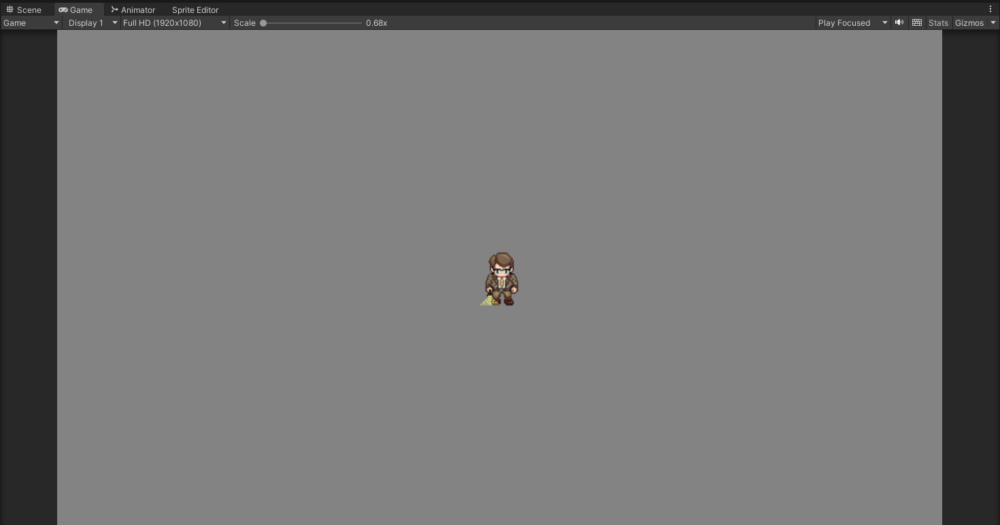

This scene if for those of you who have a few multi-frame sprite sheets containing animation clips. 

To bring yoursprite sheets into Unity, either export all the frames as pngs, or place all the frames into a single png in a regular
grid, and drag these pngs into your unity assets folder (e.g. Assets/Animation Assets/<MyCharacter>).

If your frames are all separate pngs, make sure they are aligned with each-other and all the same size so that your
character doesn't jump around between each frame. If your frames are on a grid in a single png, click the sprite in 
the project window, and change its import settings to ***SpriteMode=Multiple***, then click apply. 
Then open the sprite editor and slice the sprite so that each frame is in its own separate box. 
Click apply when this is done.

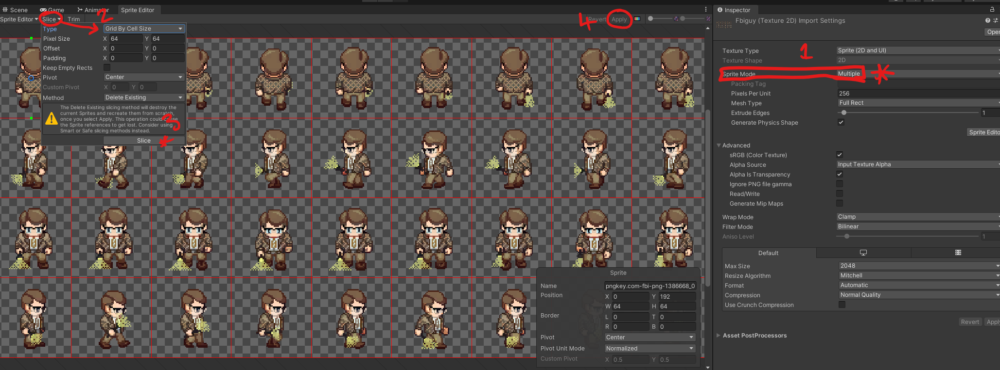

To make an animation out of these frames, simply group select the frames you want to make up the animation clip and 
drag them into the scene. You will be prompted to name the animation clip that will be created (e.g. walk-north). Do
this with all your animations, then right-click the project window and select **Create > Animator Controller**. 
Note some default animator controller assets might have been created automatically, you can delete them. Also delete 
any new GameObjects that have appeared in the scene, you only need the **MainCamera** and **SpriteSheetAnimator** 
objects in the scene.

The example assets for this scene can be found in ***Assets/Animation Assets/FBIGuy***. The example uses the "all 
frames in one image" approach. Your own character assets folder should resemble this (i.e. one animator controller,
several animations and the source image(s)).

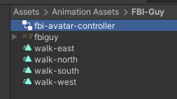

### Using the Scene:

1. Open the ***SpriteSheets*** scene (***Assets/Scenes/SpriteSheets***)

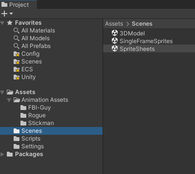

2. In the hierarchy, select the GameObject named **SpriteSheetController**

3. In the inspector, locate the **MechanimController** script and expand the **AnimationData** drop-down.

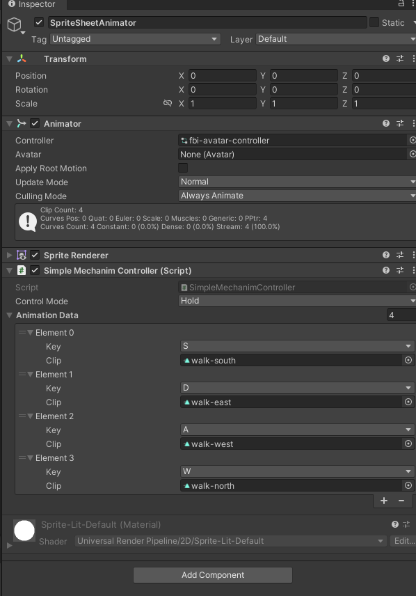

4. Replace the existing animation clips with your own.

5. If you want to, change the keys assigned to them and either add more or delete any entries you don't need.

6. Play the scene, see the animation clip playing, then, with the play window focussed, press the keys you've assigned to switch between clips.

---
## 3D Animations

This scene is for people with 3D rigged models with animations. 

To bring your models into unity, export them as .fbx format and place them in your assets folder. If you click on your
model in Unity you should see it's properties in the inspector. Here you can assign unity materials to replace those
from the source program, and you should be able to see your animations listed in the animations tab. In the animations
tab you can also set your animation to loop, if you want them to play on a loop during the preview.

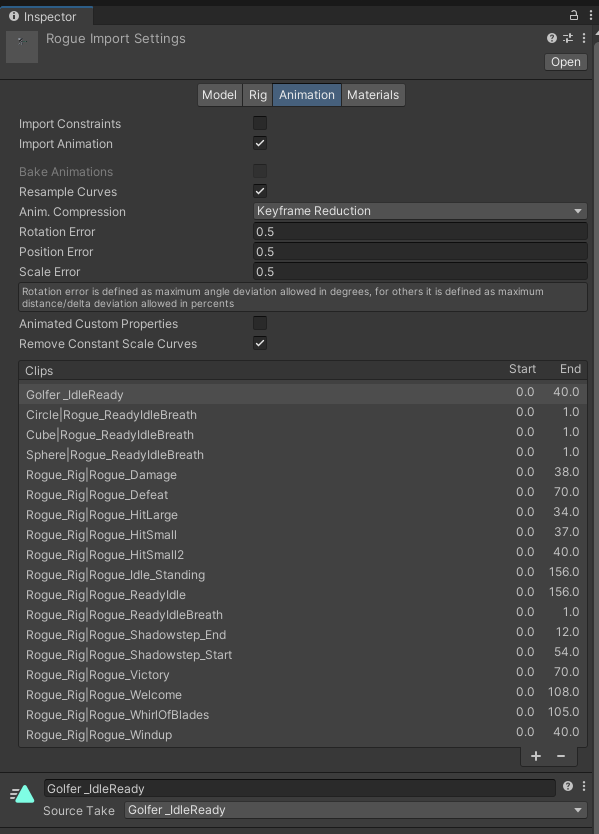

With the model imported, right-click the project window and select **Create > Animator Controller**. Double-click to
open the controller editor window.

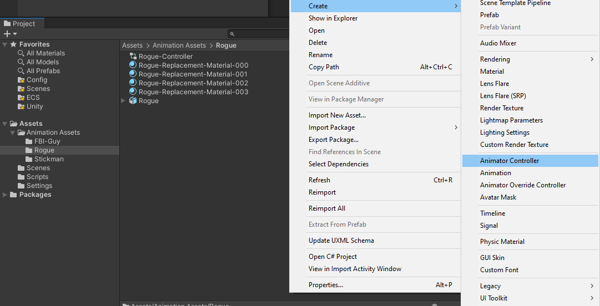

Now go back to the project window, click your model and expand the dropdown and locate the animation clips in the model.

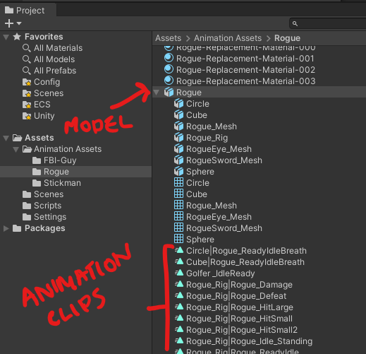

Drag the animation clips from here into the animation controller editor window.
You should see them show up as states. Finally, connect the **ANY-STATE** box to each 
of the separate states to ensure they can all transition into one another.

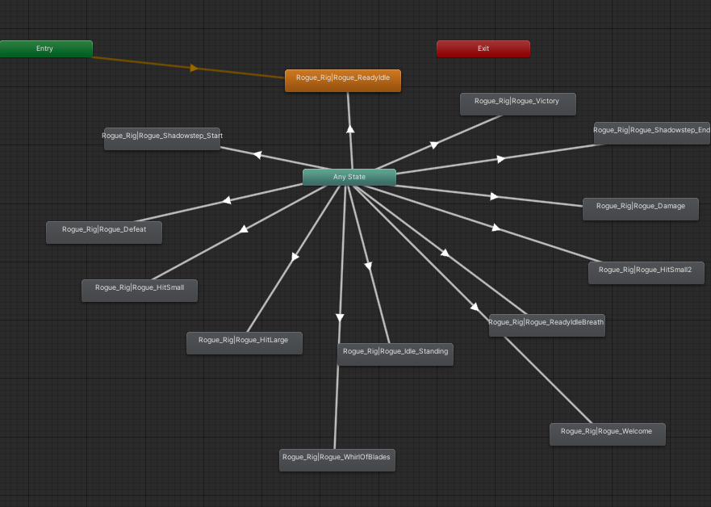

### Using the Scene:

1. Open the ***3DModel*** scene (***Assets/Scenes/3DModel***)

2. In the hierarchy, select the GameObject named **Rogue** and disable it.

3. Drag your model into the scene and position it so that the camera can see it.

4. Select the model in the hierarchy

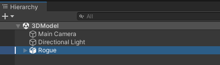

5. In the inspector window, click **Add Component** and add a **MechanimController** script to it (this should also add an Animator component at the same time).

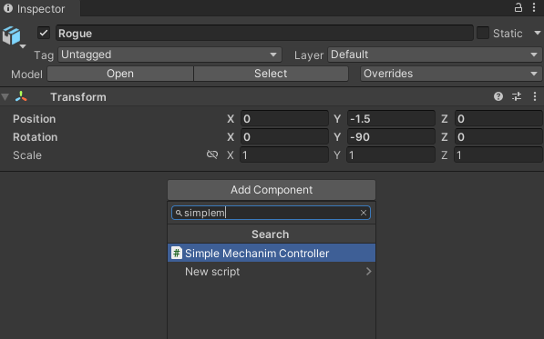

6. In the **MechanimController** script, expand the **AnimationData** drop-down.

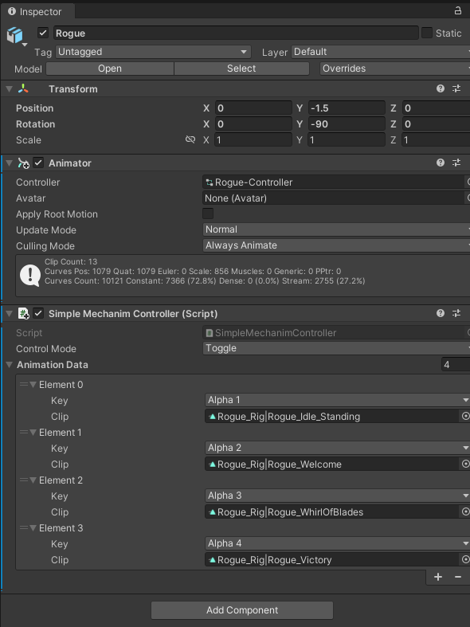

7. Replace the existing animation clips with your own.

8. If you want to, change the keys assigned to them and either add more or delete any entries you don't need.

9. Play the scene, see the animation playing, then, with the play window focussed, press the keys you've assigned to change the animation.

---

## Adjusting the Camera

To adjust the camera, with the scene open, locate the **MainCamera** GameObject in the hierarchy.
Click on it to open its inspector. In the inspector you can find various settings like Orthographics Size (for the 2D scenes)
and FOV (for the 3D scene). Use these to change the camera's zoom level. You can also change the camera background color from here.

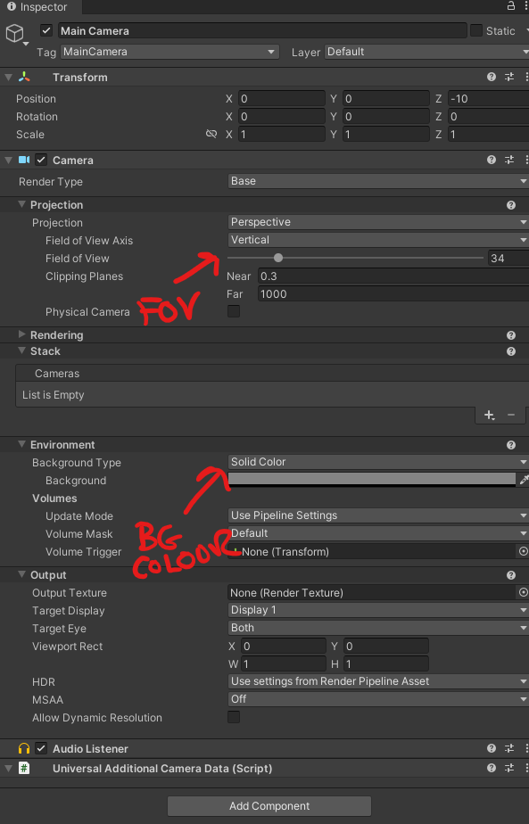

Feel free to experiment with adding a background image behind your model if you would like something more interesting than the block color background from the camera.

